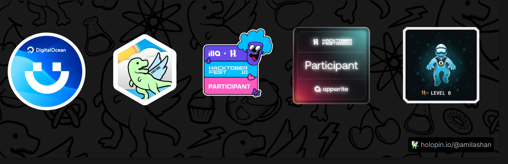
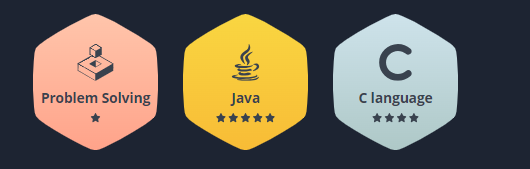

<h1 align="center">
    
</h1>

 
<h3 align="center">Final year student pursuing BICT (Hons) in Software Technologies with a strong passion for DevOps | CCNA</h3>

  

- 🔭 I’m currently studying on **South Eastern University**

- 🌱 I’m currently learning **DevSecOps & Cloud Devops**

- 👨‍💻 All of my projects are available at [https://github.com/ICT156](https://github.com/ICT156)

- 💬 Ask me about **DevOps**

- 📫 How to reach me **amilashanes@gmail.com**

<h3 align="left">Connect with me:</h3>

<h3 align="left">Languages and Tools:</h3>

                             

<h3 align="center">
    
</h3>

 
